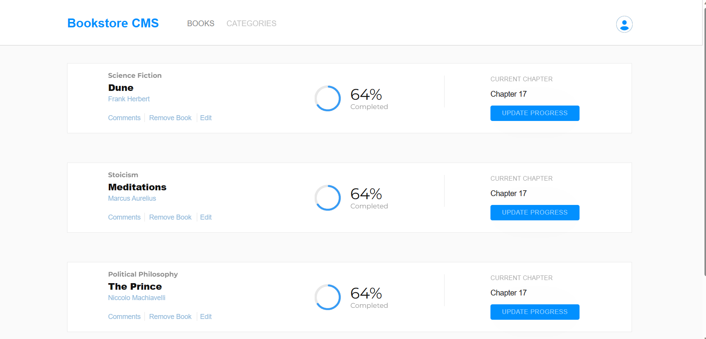

# Bookstore

<a name="readme-top"></a>

<div align="center">
    
  <br/>
  <h3><b>The Bookstore</b></h3>

</div>

<!-- TABLE OF CONTENTS -->

# 📗 Table of Contents

- [Bookstore](#bookstore)
- [📗 Table of Contents](#-table-of-contents)
- [📖Bookstore ](#bookstore-)
  - [🛠 Built With ](#-built-with-)
    - [Tech Stack ](#tech-stack-)
    - [Key Features ](#key-features-)
  - [🚀 Live Demo ](#-live-demo-)
  - [💻 Getting Started ](#-getting-started-)
    - [Prerequisites](#prerequisites)
    - [Setup](#setup)
    - [Install](#install)
    - [Usage](#usage)
    - [Run tests](#run-tests)
    - [Deployment ](#deployment-)
  - [👥 Author ](#-author-)
  - [🔭 Future Features ](#-future-features-)
  - [🤝 Contributing ](#-contributing-)
  - [⭐️ Show your support ](#️-show-your-support-)
  - [🙏 Acknowledgments ](#-acknowledgments-)
  - [❓ FAQ ](#-faq-)
  - [📝 License ](#-license-)

<!-- PROJECT DESCRIPTION -->

# 📖Bookstore <a name="about-project"></a>

This project will lay the foundations for my Bookstore website. I will create the user interface using React.

## 🛠 Built With <a name="built-with"></a>
HTML,
CSS,
JavaScript,
React.js

### Tech Stack <a name="tech-stack"></a>

<details>
  <summary>Client</summary>
  <ul>
    <li><a href="https://developer.mozilla.org/en-US/docs/Web/HTML">HTML</a></li>
    <li><a href="https://developer.mozilla.org/en-US/docs/Web/CSS">CSS</a></li>
    <li><a href="https://developer.mozilla.org/en-US/docs/Web/JavaScript">JavaScript</a></li>
    <li><a href="https://react.dev/">React.js</a></li>
  </ul>
</details>

<details>
  <summary>Package Manager</summary>
  <ul>
    <li><a href="https://www.npmjs.com/">npm</a></li>
  </ul>
</details>
<details>
  <summary>Linters</summary>
  <ul>
      <li><a href="https://eslint.org/">ESLint</a></li>
      <li><a href="https://stylelint.io/">Stylelint</a></li>
  </ul>
</details>

<!-- Features -->

### Key Features <a name="key-features"></a>

- **Add books**
- **Use React Router**

<p align="right">(<a href="#readme-top">back to top</a>)</p>

<!-- LIVE DEMO -->

## 🚀 Live Demo <a name="live-demo"></a>

- [Live Demo Link](https://curious-raindrop-ebe2c8.netlify.app/)

<p align="right">(<a href="#readme-top">back to top</a>)</p>

<!-- GETTING STARTED -->

## 💻 Getting Started <a name="getting-started"></a>


To get a local copy up and running, follow these steps.

### Prerequisites

In order to run this project you need:

- A web browser to view output e.g [Google Chrome](https://www.google.com/chrome/).
- An IDE e.g [Visual studio code](https://code.visualstudio.com/).
- `node` should be installed in your local machine, [node website](https://nodejs.org/en/download/).
- Install the `npm` package manager use this [to install both node and npm](https://docs.npmjs.com/downloading-and-installing-node-js-and-npm).
- [A terminal](https://code.visualstudio.com/docs/terminal/basics).

### Setup

Clone this repository to your desired folder or download the Zip folder:

```
https://github.com/Alejandroq12/bookstore.git

```

- Navigate to the location of the folder in your machine:

**``you@your-Pc-name:~$ cd bookstore``**

### Install

To install all dependencies, run:

```
npm install
```

### Usage

To run the project, follow these instructions:

- After Cloning this repo to your local machine.
- You must use `npm start` command in terminal to run this at the localhost.

### Run tests

To run tests, run the following command:

- Track CSS linter errors run:
```
npx stylelint "**/*.{css,scss}"
```
- Track JavaScript linter errors run:
```
npx eslint "**/*.{js,jsx}"
```

### Deployment <a name="deployment"></a>

You can deploy this project using: GitHub Pages,
- I used GitHub Pages to deploy my website.
- For more information about publishing sources, see "[About GitHub pages](https://docs.github.com/en/pages/getting-started-with-github-pages/about-github-pages#publishing-sources-for-github-pages-sites)".

<p align="right">(<a href="#readme-top">back to top</a>)</p>

<!-- AUTHORS -->

## 👥 Author <a name="authors"></a>

👤 **Julio Quezada**

- GitHub: [Alejandroq12](https://github.com/Alejandroq12)
- Twitter: [@JulioAle54](https://twitter.com/JulioAle54)
- LinkedIn: [Julio Quezada](https://www.linkedin.com/in/quezadajulio/)

<p align="right">(<a href="#readme-top">back to top</a>)</p>

<!-- FUTURE FEATURES -->

## 🔭 Future Features <a name="future-features"></a>

- [ ] **I will create a responsive website.**
- [ ] **- **Fetch data from API.**

<p align="right">(<a href="#readme-top">back to top</a>)</p>

<!-- CONTRIBUTING -->

## 🤝 Contributing <a name="contributing"></a>

Contributions, issues, and feature requests are welcome!

Feel free to check the [issues page](../../issues/).

<p align="right">(<a href="#readme-top">back to top</a>)</p>

<!-- SUPPORT -->

## ⭐️ Show your support <a name="support"></a>

If you like this project give me a star ⭐️

<p align="right">(<a href="#readme-top">back to top</a>)</p>

<!-- ACKNOWLEDGEMENTS -->

## 🙏 Acknowledgments <a name="acknowledgements"></a>

I want to thank all my colleagues that share knowledge with and inspired to to improve each day.

<p align="right">(<a href="#readme-top">back to top</a>)</p>

<!-- FAQ  -->

## ❓ FAQ <a name="faq"></a>

- **Did you created this project from zero?**

  - Of course, as if it were a real life job scenario.

<p align="right">(<a href="#readme-top">back to top</a>)</p>

<!-- LICENSE -->

## 📝 License <a name="license"></a>

This project is [LICENSE](./LICENSE) licensed.

<p align="right">(<a href="#readme-top">back to top</a>)</p>